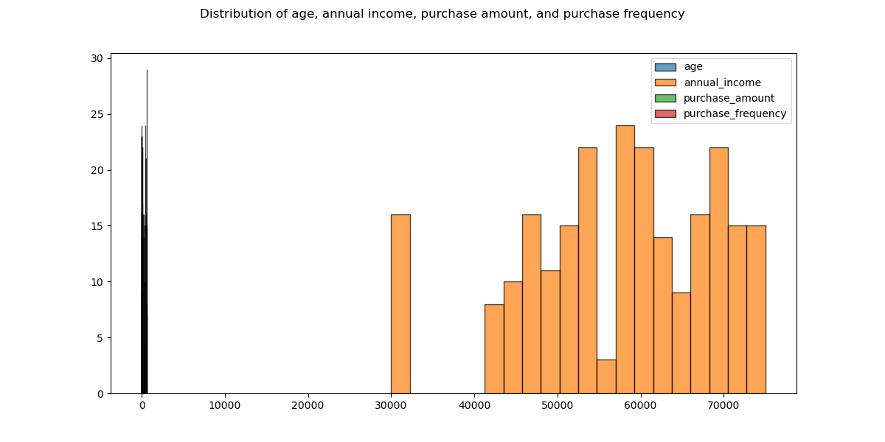
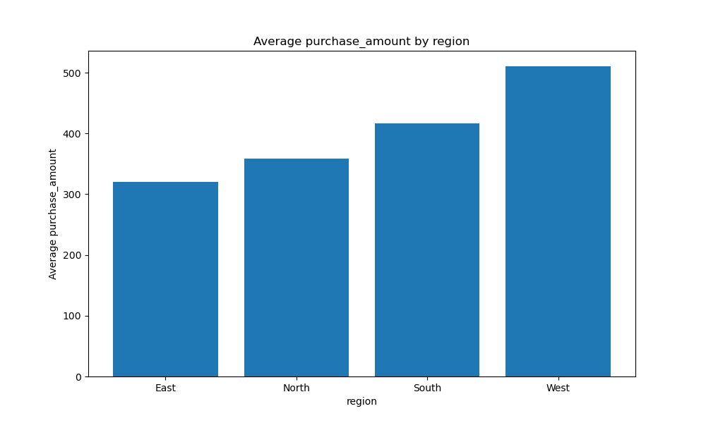

# Summary Report

### Summary Statistics

| Metric | column | column_0 | column_1 | column_2 | column_3 | column_4 | column_5 | column_6 | column_7 | column_8 |
|--------|------|------|------|------|------|------|------|------|------|------|
| statistic | statistic | count | null_count | mean | std | min | 25% | 50% | 75% | max |
| user_id | user_id | 238.0 | 0.0 | 119.5 | 68.84886830345629 | 1.0 | 60.0 | 120.0 | 179.0 | 238.0 |
| age | age | 238.0 | 0.0 | 38.6764705882353 | 9.35111812969458 | 22.0 | 31.0 | 39.0 | 47.0 | 55.0 |
| annual_income | annual_income | 238.0 | 0.0 | 57407.56302521008 | 11403.875717398343 | 30000.0 | 50000.0 | 59000.0 | 67000.0 | 75000.0 |
| purchase_amount | purchase_amount | 238.0 | 0.0 | 425.6302521008403 | 140.0520617813922 | 150.0 | 320.0 | 440.0 | 530.0 | 640.0 |
| loyalty_score | loyalty_score | 238.0 | 0.0 | 6.794117647058823 | 1.8990468014330923 | 3.0 | 5.5 | 7.0 | 8.3 | 9.5 |
| region | region | 238 | 0 | None | None | East | None | None | None | West |
| purchase_frequency | purchase_frequency | 238.0 | 0.0 | 19.798319327731093 | 4.562884260556764 | 10.0 | 17.0 | 20.0 | 23.0 | 28.0 |

### Histograms for Selected Columns

### Bar Plot: Average purchase_amount by region

